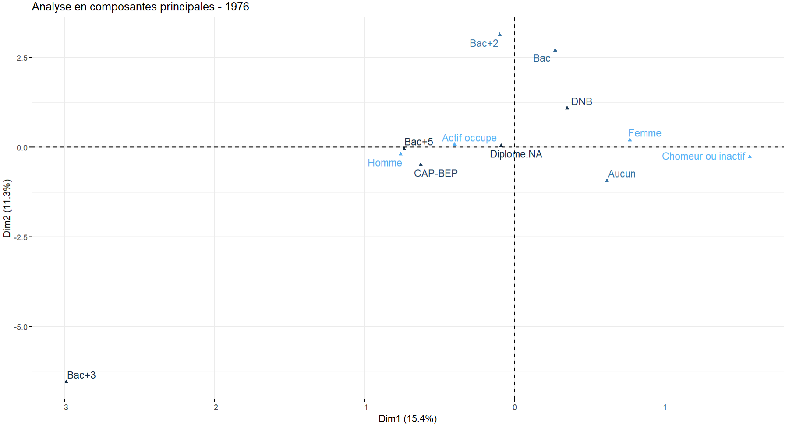
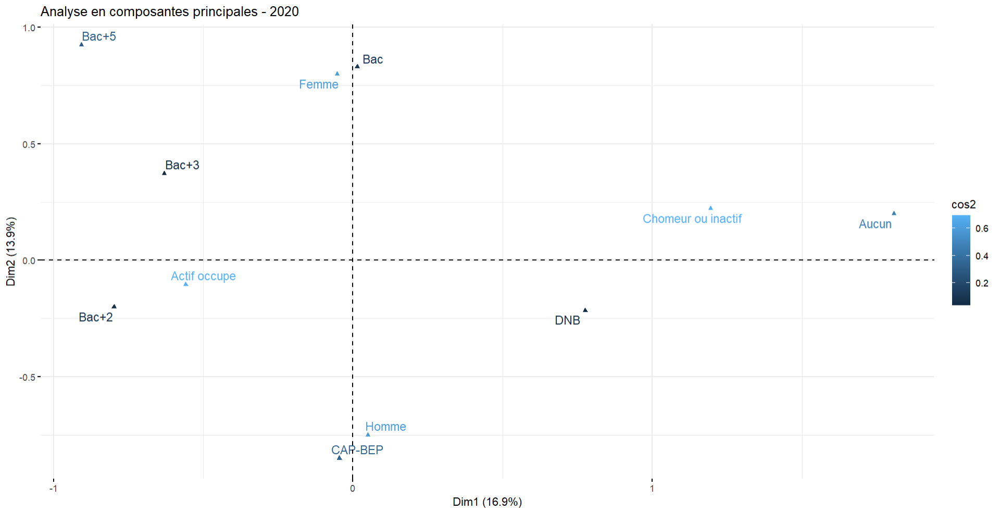

```{r setup, include=FALSE}
knitr::opts_chunk$set(echo = FALSE)
knitr::opts_chunk$set(dev = "cairo_pdf")
options(tinytex.verbose = TRUE)
library(kableExtra)

load("emploi.RData")
load("NEET.RData")
load("Jeunes_census.RData")
load("emploichom.RData")
load("Jeunes_Actifs_Etudiants.RData")

options(tinytex.verbose = TRUE)
source("emploi-formation.R", encoding = "UTF-8")

theme_set(theme_minimal())
knitr::opts_chunk$set(out.height = "60%", fig.asp=7/16, fig.align='center', fig.width=6)
```


## Introduction (1/3)

- Stage réalisé au sein du **laboratoire SAGE** (Sociétés, Acteurs, Gouvernement en Europe).
- Supervisé par **Monsieur Julien GOSSA** (maître de conférences en informatique et membre associé à l'axe 4 du laboratoire).


## Introduction (2/3)

- Recherche sur **la transition formation/emploi** en exploitant l'enquête Emploi.
- Analyses sur **le long terme** (années 1971 à 2020) pour percevoir les évolutions historiques de la formation et de l'activité en France.
- **Population étudiée** : jeunes Français de 15 à 29 ans.  

- **Outils de travail** : R, R Markdown, GitHub et Shiny. 

## Introduction (3/3)

- Forte constance de l'effectif des jeunes chômeurs et inactifs révélée par l'exploitation exploratoire.

```{r saphire, fig.cap="Activité des jeunes français.es entre 16 et 24 ans, depuis 1968, Source : base SAPHIR"}
load("saphire-2017.RData")
saphire <- saphire %>%
  mutate(
    Activité = fct_recode(Activité,
      "Actifs ayant un emploi" = "Militaires du contingent",
      "Inactifs" = "Anciens actifs",
      "Inactifs" = "Autres inactifs"),
    ) %>%
  mutate(Activité = factor(Activité,levels=c(
    "Actifs ayant un emploi","Étudiants ou élèves","Chômeurs","Inactifs"
  ))) %>%
  filter(Nationalité %in% c("Français de naissance","Français par acquisition")) %>%
  group_by(Année,Age,Sexe,Diplôme,Secteur.activité,Activité,CSP) %>%
  summarise(Population = sum(Population)) %>%
  ungroup()
activités.palette <- RColorBrewer::brewer.pal(8,"Paired")[c(2,4,8,7)]
activités.sim.palette <- RColorBrewer::brewer.pal(10,"Paired")[c(2,8,7,9,4)]
saphire.last.année <- max(saphire$Année)
saphire %>%
  filter(Age>=16,Age<=29) %>%
  group_by(Année,Activité) %>%
  summarise(Population = sum(Population)/1000000) %>%
  #mutate(Activité=fct_rev(Activité)) %>%
  ggplot(aes(x=Année,y=Population, fill=Activité, color=Activité, group=Activité)) + 
  geom_area(alpha=0.5) +
  expand_limits(y=0) +
  scale_fill_manual(values=activités.palette) +
  scale_color_manual(values=activités.palette) +
  ylab("Population 16-29 ans (millions)") +
  #theme_cpesr_cap() +
  theme(axis.title.x = element_blank(), legend.position = "bottom" )
```

## Introduction (5/5)

- **Problématique** : De quelle manière s'articulent la formation, l'emploi et la jeunesse entre les années 1970 et aujourd'hui ?  


- **Hypothèse** : La formation a un rôle d'amortisseur entre la jeunesse et l’emploi : lorsque
des emplois sont disponibles, les jeunes sortiraient plus tôt du système d'éducation ; lorsque les emplois sont rares, les jeunes prolongeraient leurs études.

# Analyses et résultats

## Traitement de données

- Réalisation d'un traitement de données des enquêtes Emploi effectuées de 1971 à 2020. 

- Création d'une table de données harmonisée et optimisée comportant nos variables d'intérêt.

```{r annexe.7, out.width="100%",fig.align='center'}
  #

tibble(
  Données = c("Sources", "Groupement"),
  `Nombre de bases` = c(nrow(volumetrie),1),
  `Nombre de variables` = c(max(volumetrie$Variables), ncol(emploi)),
  `Nombre d'observations` = format(c(sum(volumetrie$Observations), nrow(emploi)), big.mark=" ")
  ) %>%
  kableExtra::kable(align = c("l","r","r","r"), booktabs = T) %>%
  kable_styling(latex_options = c("scale_down"))
```


## Traitement de données

- Importante réduction du nombre de lignes de notre base finale en synthétisant l'information.
- Prise en compte de la pondération pour la variable "Population".


### Base de données harmonisée

```{r annexe.8}
  #
emploi %>%
  filter(AgeQ == 20) %>%
  sample_n(4) %>% 
  arrange(Annee) %>%
  mutate(Population = as.integer(Population)) %>%
  kableExtra::kable(booktabs = T) %>%
  kable_styling(latex_options = c("scale_down"))
```


## Graphiques avec vue long terme

- La création de cette base harmonisée nous permet de réaliser des graphiques sur une longue période.  

Graphique 1 : Les jeunes de 15 à 29 ans en France de 1971 à 2020 selon le statut d’activité
```{r activite.34}
  plot_activite7() +
  theme(legend.position = "bottom")
```

## Graphiques avec vue long terme

- Les jeunes sont de plus en plus diplômés mais la part des jeunes chômeurs ou inactifs ne diminue pas pour autant. 

Graphique 2 : Répartition des jeunes de 25 à 29 ans selon le niveau de diplôme en France
```{r dip2}
  plot_activite8(agemin=25, agemax = 29)
```

## Comparaisons avec Eurostat

- Eurostat a également traité les données de l'enquête Emploi (Labour Force Survey).

- Résultats très similaires entre notre base et Eurostat

Les jeunes de 15 à 29 ans de 1971 à 2021 en France
```{r activite.44}
  plot(plot_jeunes2)
```


## Réalisation de tableaux croisés


```{r activite.64, out.width="70%", out.height=NULL, fig.align='center', fig.asp=NULL}
  knitr::include_graphics("Images/gtsummary/tabledipl2020.PNG")
```


## Réalisation d'une ACM (Année 1976)

- Femmes associées aux chômeurs/inactifs et aux faibles niveaux de diplôme.

- Hommes associés aux actifs occupés et aux niveaux de diplôme plus élevés.
```{r activite.74, out.width="70%", out.height=NULL, fig.align='center', fig.asp=NULL}
  
```


## Réalisation d'une ACM (Année 2020)

- Femmes maintenant associées aux niveaux bac+3 et bac+5. 

- Hommes davantage associés à des niveaux de diplôme plus faibles. 

```{r activite.76,  out.width="70%", out.height=NULL, fig.asp=NULL}
  
```

## Pour résumer 

- Difficile de dire avec certitude si la formation agit véritablement comme un amortisseur entre la formation et l'emploi.

- Néanmoins, existence d'un **lien très fort** entre chômage (ou inactivité) et niveau de diplôme faible.

- Transformation du système scolaire/universitaire produisant une population jeune globalement **plus qualifiée** mais ce changement n'a pas permis de faire diminuer **la part des jeunes chômeurs/inactifs**.

## Conclusion du stage (1/2)

- **Points positifs** : Grande liberté accordée dans l'organisation et la direction à prendre. Tuteur de stage toujours disponible pour m'accompagner et m'aider dans mes tâches. Pluridisciplinarité du stage.

- **Point négatif** : Beaucoup de temps passé à m'autoformer, j'aurais aimé produire plus de résultats et valider/invalider notre hypothèse.


## Conclusion du stage (2/2)

- **Compétences techniques** : Meilleure maîtrise de R. Découverte de GitHub, R Markdown, Shiny et de certains packages (ex : gtsummary, survey).

- **Compétences professionnelles** : Communiquer efficacement avec des experts d'autres disciplines, mieux ranger et organiser son espace de travail.

- Volonté de poursuivre dans une profession alliant informatique et compétences de démographe. 

# Démonstration de l'application Shiny


