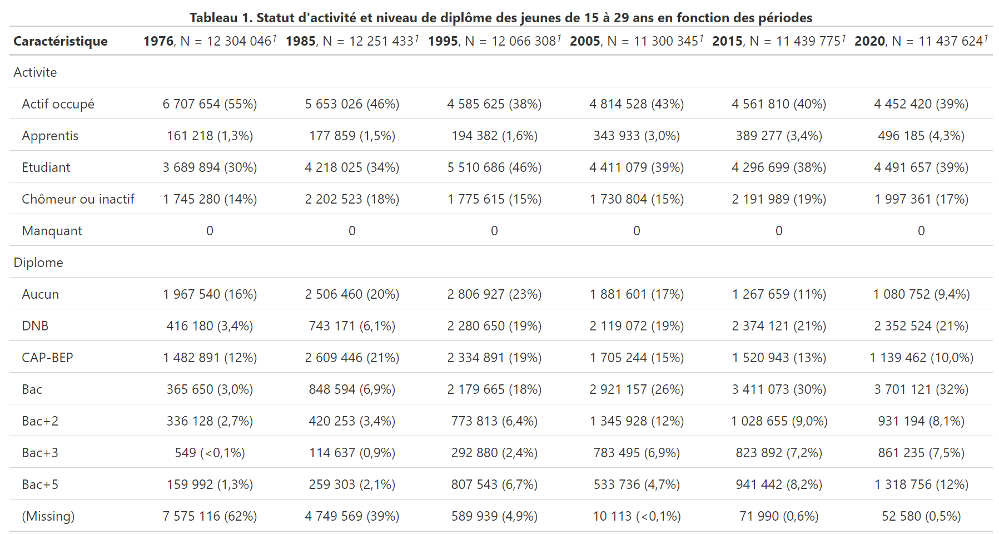
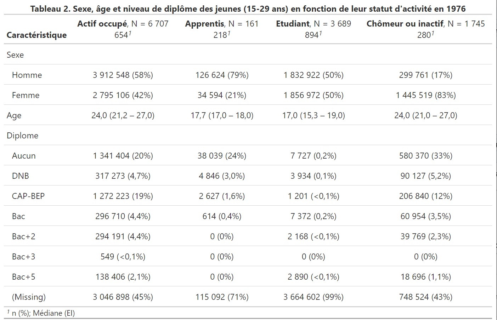
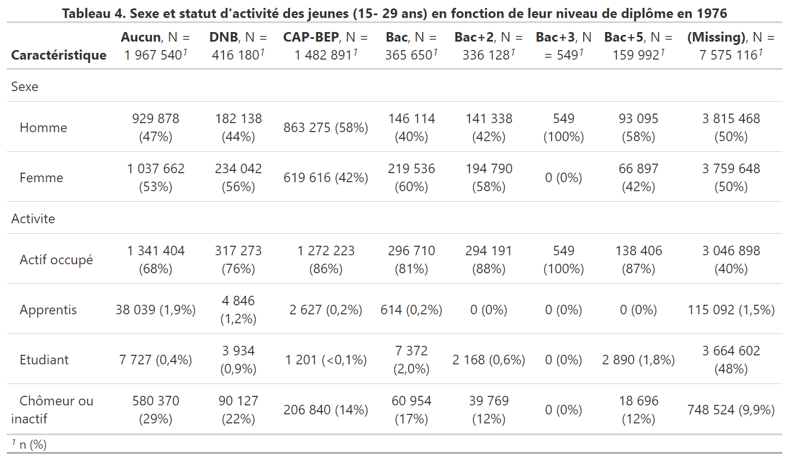
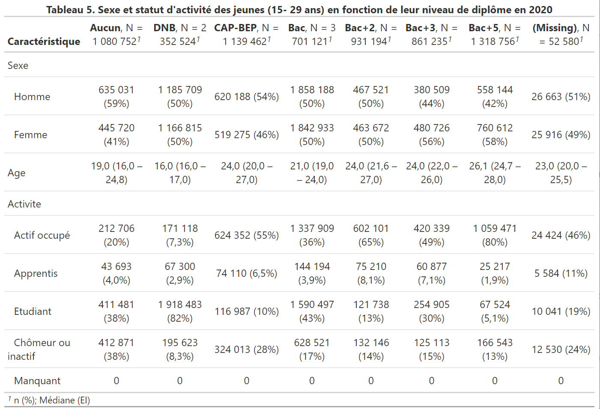
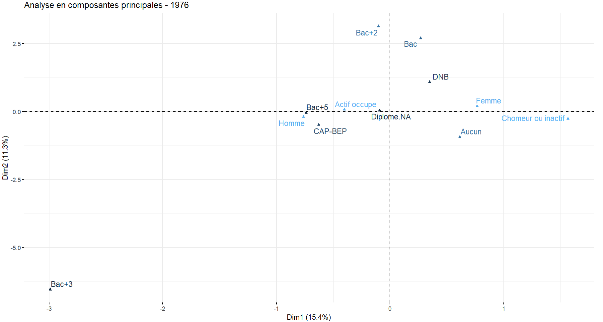
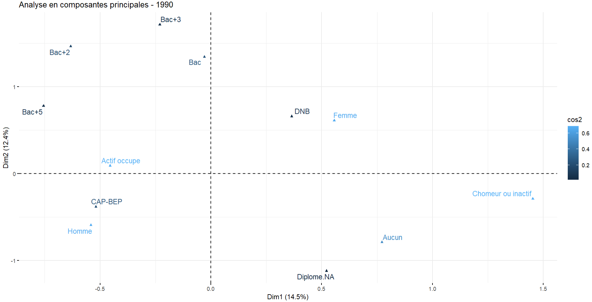

```{r setup, include=FALSE}
knitr::opts_chunk$set(echo = FALSE, warning = FALSE)

load("emploi.RData")
load("NEET.RData")
load("Jeunes_census.RData")
load("emploichom.RData")
load("Jeunes_Actifs_Etudiants.RData")

options(tinytex.verbose = TRUE)
source("emploi-formation.R", encoding = "UTF-8")
```


# Introduction

Le stage de Master 1 visant à découvrir le monde professionnel ou celui de la recherche en démographie représentait pour moi une occasion d’avoir une première approche du secteur, des activités et des structures vers lesquels je souhaiterais me diriger après l’obtention du Master. Portant un intérêt tout particulier à la programmation sur les logiciels R et SAS, j’ai donc souhaité réaliser un stage qui me permettrait d’améliorer mon niveau en programmation tout en utilisant mes compétences en démographie. Ne sachant pas vraiment vers quelles structures ou secteurs me diriger pour réellement m’améliorer sur R et/ou SAS, j’ai d’abord souhaité m’orienter vers un stage orienté data, bien que, sur le long terme, je ne veuille pas travailler dans ce secteur après le master.
Après une dizaine de candidatures envoyées à plusieurs organismes pour un stage dans la data, j’ai finalement répondu à une proposition de stage émise par Monsieur Julien GOSSA, enseignant-chercheur en informatique et Madame Pauline BOYER, doctorante en sciences politiques et sciences des données. Ce stage consistait globalement à faire de l’exploration de données démographiques sur la transition formation/emploi, probablement à partir de l’enquête Emploi.
 J’ai choisi d’envoyer ma candidature pour plusieurs raisons. Tout d’abord, la thématique du stage m’a depuis toujours intéressée, j’ai notamment suivi des cours optionnels de sociologie du travail et d’économie durant mes années passées en licence. De plus, cette thématique se distinguait des problématiques abordées habituellement en démographie (mortalité, vieillissement démographique, fécondité, migrations, etc…), ce qui pouvait certes être assez déroutant, mais c’était avant tout très motivant pour moi de sortir d’une certaine zone de confort et de d'approfondir des problématiques moins abordées en cours. J’ai également voulu faire ce stage car ses missions permettaient de s’améliorer en technique sur R, mais également sur d’autres logiciels, via la formation proposée en R Markdown et GitHub par Monsieur Julien GOSSA, qui sont des logiciels très utiles pour créer des rapports bien réalisés et partager les fichiers entre les différentes personnes qui travaillent sur un même projet. Lorsque j’ai été acceptée pour ce stage, j’ai fait part, avec l’aide de Monsieur Didier BRETON, de mon envie de m’améliorer en technique, c’est pourquoi Monsieur GOSSA a proposé de créer une application Shiny durant le stage qui permettra de manipuler facilement les différents paramètres des graphiques réalisés.
 
Le stage a duré en tout 8 semaines, je pouvais choisir d'effectuer mon travail au bureau des doctorants de la Faculté des Sciences Sociales ou bien en télétravail, ce qui était très pratique pour moi et me permettait de m'organiser plus facilement et de gagner du temps. 
Je communiquais avec Monsieur Julien GOSSA par Discord, généralement sur le serveur de la CPESR (Conférence des praticiennes et praticiens de l’enseignement supérieur et de la recherche) qui est une "Organisation non militante œuvrant à la production et à la diffusion de connaissances sur l’ESR (Enseignement supérieur et de la recherche), [...] la CPESR réagit aux évolutions du monde de l’enseignement supérieur et de la recherche et propose des éléments de compréhension, de décision et de pilotage".(citer source) Communiquer sur ce serveur a permis aux autres membres du serveur de s'informer sur nos avancées et de nous aider lorsque nous rencontrions des difficultés.
Enfin, nous organisions une réunion environ toutes les deux semaines afin de faire un point sur ce qui a été fait et ce vers quoi je devais ensuite porter mon attention.

La suite de ce document est structurée en trois parties distinctes ayant pour but d'informer sur le contexte, les missions et le bilan de ce stage : la première partie présente ainsi ma principale mission ainsi que la manière dont cette dernière s'inscrit dans une perspective plus globale. La deuxième partie est la plus fournie puisqu'elle présente mes principales réalisations ainsi que les raisonnements, résultats et conclusions auxquelles nous sommes parvenus. Enfin, la troisième et dernière partie est plus personnelle puisqu'elle comporte une analyse assez subjective de ma contribution, de ce stage, et de ce qu'il m'a apporté personnellement et professionnellement. 

# I. Présentation de l'organisme et de ma mission

J'ai réalisé mon stage au sein du Laboratoire SAGE (Sociétés, Acteurs, Gouvernement en Europe). Selon le site Internet officiel du laboratoire, ce dernier "réunit des chercheurs et des enseignants-chercheurs qui travaillent sur les processus de transnationalisation (et tout particulièrement la construction européenne comme réponse à une mondialisation croissante) et sur les transformations des structures et des dynamiques sociales et politiques qu’ils induisent. Dans cette perspective, une attention particulière est portée à la sociologie des acteurs, à l’élaboration et la mise en œuvre de normes et de dispositifs publics et à la genèse d’enjeux sociétaux (environnement, santé, vieillissement, vulnérabilités sociales, culture, villes) ainsi qu’à leurs dynamiques de territorialisation à différentes échelles. [...] SAGE est une UMR de sciences sociales du politique et se positionne de manière originale sur des thèmes porteurs tels que la santé, le droit de l'environnement et le développement durable urbain, les politiques culturelles et sociales, l’internationalisation et la circulation des élites, la sociologie politique de l’Europe et les mobilisations collectives. Les recherches se structurent en 6 axes étroitement liés au sein desquels circulent les membres de l’UMR." (citer source)


J'ai personnellement travaillé sous la direction de Monsieur Julien GOSSA, enseignant-chercheur en informatique associé à l'axe 4 Population, inégalités et politiques sociales, afin de réaliser de l'exploration de données provenant de l'enquête Emploi afin d'avoir une meilleure compréhension de la transition formation/emploi.

Son équipe travaille à la conception d'une méthodologie pour éclairer l'action 
publique par l'exploitation des données ouvertes, particulièrement celles de l'ESR (Enseignement Supérieur et Recherche), et qui concernent donc, entre autres, les universités et les étudiants.

Ce travail nécessitait une mise en contexte sur un plus long terme, permettant de 
mieux saisir quelles sont les évolutions historiques de l'appareil de formation français.
C'est dans ce cadre que l'équipe de Julien GOSSA a effectué une exploitation exploratoire de la 
base SAPHIR de l'INSEE, comportant des données issues du recensement de la population français.
L'objectif est de visualiser la massification scolaire (l'augmentation du nombre d'étudiants)
et son rapport avec l'insertion professionnelle, donc l'emploi des jeunes.

Cette exploitation exploratoire a révélé une remarquable constance des jeunes chômeurs et inactifs (voir graphique ci-dessous).
Cela a  permis de soulever l'hypothèse d'un rôle d'« amortisseur » de la formation 
entre la jeunesse et l'emploi : lorsque des emplois sont disponibles, les jeunes
sortiraient plus tôt du système d'éducation ; lorsque les emplois sont rares, les jeunes
prolongeraient leurs études afin d'éviter de se retrouver chômeur ou inactif durant une longue période.


### Activité des jeunes français.es entre 16 et 24 ans, depuis 1968
```{r saphire, fig.cap="Activité des jeunes français.es entre 16 et 24 ans, depuis 1968, Source : base SAPHIR", out.width="100%", fig.align='center'}
load("saphire-2017.RData")
saphire <- saphire %>%
  mutate(
    Activité = fct_recode(Activité,
      "Actifs ayant un emploi" = "Militaires du contingent",
      "Inactifs" = "Anciens actifs",
      "Inactifs" = "Autres inactifs"),
    ) %>%
  mutate(Activité = factor(Activité,levels=c(
    "Actifs ayant un emploi","Étudiants ou élèves","Chômeurs","Inactifs"
  ))) %>%
  filter(Nationalité %in% c("Français de naissance","Français par acquisition")) %>%
  group_by(Année,Age,Sexe,Diplôme,Secteur.activité,Activité,CSP) %>%
  summarise(Population = sum(Population)) %>%
  ungroup()
activités.palette <- RColorBrewer::brewer.pal(8,"Paired")[c(2,4,8,7)]
activités.sim.palette <- RColorBrewer::brewer.pal(10,"Paired")[c(2,8,7,9,4)]
saphire.last.année <- max(saphire$Année)
saphire %>%
  filter(Age>=16,Age<=29) %>%
  group_by(Année,Activité) %>%
  summarise(Population = sum(Population)/1000000) %>%
  #mutate(Activité=fct_rev(Activité)) %>%
  ggplot(aes(x=Année,y=Population, fill=Activité, color=Activité, group=Activité)) + 
  geom_area(alpha=0.5) +
  expand_limits(y=0) +
  scale_fill_manual(values=activités.palette) +
  scale_color_manual(values=activités.palette) +
  ylab("Population 16-29 ans (millions)") +
  #theme_cpesr_cap() +
  theme(axis.title.x = element_blank())
```

L’un des objectifs de ce stage a donc été de confirmer ou d'infirmer cette hypothèse, en exploitant des données plus précises que celles de la base SAPHIR, comme celles des enquêtes emplois de l’INSEE. Je devais donc apporter mes compétences de démographe afin d'aider notamment au traitement, à l'exploitation, à l'analyse et à la valorisation des données de l'enquête Emploi.
Le stage a été pensé pour être également une occasion d’explorer plus largement l’articulation entre jeunesse, formation et emploi, et de tenter de trouver des moyens de caractérisation et de visualisation de cette articulation.

Ainsi, le travail effectué pendant le stage s'inscrit dans un ensemble de travaux portant sur l'exploitation de données de l'ESR et dont les productions et conclusions pourront être mobilisées pour guider des travaux réalisés ultérieurement et qui porteront sur d'autres aspects/dimensions de l'ESR.

# II. Les missions réalisées tout au long du stage

## 1. Réalisation d'un traitement de données de 1971 à 2020

L'ensemble de mes missions ont été réalisées en utilisant R pour le codage, R Markdown pour présenter de manière propre et organisée les résultats, Shiny pour modifier rapidement les paramètres de divers graphiques et GitHub qui nous a permis de mettre les divers fichiers en commun dans un dépôt, afin qu'ils soient consultables et modifiables à tout moment dans l'application R par Monsieur Julien GOSSA et moi-même.

Comme annoncé précédemment, la source principale que nous avons utilisée pour faire nos analyses et étudier le lien entre la formation et l'emploi est l'enquête Emploi. Les données de l'enquête Emploi ont été commandées sur Progedo par Monsieur Julien GOSSA et moi-même avant le début du stage afin de gagner du temps. Avant que le stage ne commence, Monsieur Julien GOSSA avait déjà traité puis exploité les données des enquêtes effectuées de 2003 à 2020 afin d'avoir un premier aperçu des données. Cependant, puisque nous souhaitions effectuer une analyse de données sur le long terme, ma première mission a été d'effectuer un traitement de données des enquêtes Emploi réalisées de 1971 à 2020, les données des années précédant 1971 étant difficilement exploitables.

Cette tâche, de par notamment les multiples transformations qu'a subies l'enquête Emploi de 1971 à 2020, comprenait plusieurs difficultés. Tout d'abord, il était difficile de savoir quel genre de traitement de données nous pouvions et devions réaliser à partir d'une cinquantaine de fichiers CSV et SAS (chacun regroupant les données d'une enquête réalisée à une année T). Nous avons alors décidé de créer une base de données unique qui regrouperait les variables d'intérêt de chaque année sans que cette base ne soit trop volumineuse. 

J'ai tout d'abord dû utiliser SAS pour exporter les fichiers SAS en CSV afin que tous nos fichiers de données soient au même format, puis j'ai ajouté la variable Année à tous les fichiers de données qui ne la comportaient pas, ou dont la variable indiquait seulement les deux derniers chiffres de l'année d'enquête. 

J'ai ensuite dû retrouver le nom et le codage de chaque variable d'intérêt pour les enquêtes effectuées de 1971 à 2002. Evidemment, le nom de la variable ainsi que la manière dont elle est codée pouvait changer de manière importante d'une année à l'autre (ex : la variable renseignant le statut d'activité a pour nom CSE jusqu'en 1974, puis FI jusqu'en 1989, puis se nomme ACT7 jusqu'en 2002). Il fallait alors consulter les dictionnaires des codes des diverses enquêtes Emploi et noter leurs différences pour ne pas faire des erreurs dans le recodage des variables. En réalisant ce travail, j'ai constaté que  nous pouvions néanmoins regrouper les différentes enquêtes Emploi en cinq séries au sein desquelles les enquêtes comprennent des variables et des codage identiques, les différentes séries sont les suivantes : 1971-1974, 1975-1981, 1982-1989, 1990-2002, et enfin, 2003 - 2020. Il fallut donc harmoniser le recodage en tenant compte des modifications concernant les modalités des variables d'intérêt qui se sont opérées au fil des périodes. 

Enfin, pour éviter que la base de données unique ne soit trop volumineuse, j'ai réalisé, en m'inspirant de la table créée par Monsieur GOSSA pour l'exploitation des données de 2003 à 2020, un groupement des données par année, sexe, âge révolu, âge quinquennal, niveau de diplôme et statut d'activité, puis j'ai sommé les pondérations pour chaque regroupement afin de créer une nouvelle variable de pondération en adéquation avec la nouvelle base. Avec cette méthode, les individus qui possédaient les mêmes caractéristiques relatives aux variables d'intérêt sont regroupés en une seule ligne et leur pondération est sauvegardée. J'ai réalisé une base de ce type pour chaque série, notamment à l'aide d'une fonction mise en place par Monsieur GOSSA qui permettait de rapidement lire et garder les variables les plus importantes des fichiers de données annuels afin d'optimiser le traitement de données, puis j'ai empilé les différentes bases après les avoir triées pour créer une table de données unique qui ne souffre pas d'une mauvaise fusion des tables.

```{r volumetrie}
tibble(
  Données = c("Sources", "Groupement"),
  `Nombre de bases` = c(nrow(volumetrie),1),
  `Nombre de variables` = c(max(volumetrie$Variables), ncol(emploi)),
  `Nombre d'observations` = format(c(sum(volumetrie$Observations), nrow(emploi)), big.mark=" ")
  ) %>%
  kableExtra::kable(align = c("l","r","r","r"))
```

Une fois la base unique créée, j'ai souhaité réaliser des graphiques représentant les statuts d'activité et les niveaux de diplôme des jeunes de 15 à 29 ans sur la période 1971 - 2020. 
Certains de ces graphiques (et la plupart de ceux réalisés ensuite) représentent des effectifs de jeunes et non des pourcentages/parts de jeunes, et ce, pour plusieurs raisons. Comme annoncé précédemment, l'étude que nous réalisons s'inscrit dans un ensemble de projets en lien avec l'ESR et son fonctionnement, il est donc important que nos résultats puissent être repris de manière pertinente pour éclairer les prochains travaux en lien avec l'ESR.
Il faut ainsi savoir que les budgets des universités et de l'enseignement supérieur ont décroché des effectifs au début des années 2000, d'abord avec l'abandon des modèles d'allocation des moyens tels que SAN REMO (système analytique de répartition des moyens) de 1995 à 2005 qui alloue des moyens aux universités en fonction des coûts moyens constatés puis SYMPA (système de répartition des moyens à la performance et à l’activité) de 2009 à 2019 qui allouait environ 80% des crédits selon les effectifs des personnels et étudiants et les 20% restants en fonction de la performance de l'établissement (nombre de publications, taux de réussite, etc...), puis le passage aux RCE qui allouent les crédits sur la base d'une négociation durant laquelle les universités doivent mettre en avant leurs performances pour disposer des moyens financiers dont elles ont besoin (citer source). On a donc un décrochage entre la taille de l'ESR (et les moyens financiers qui lui sont alloués) et les effectifs de jeunes qui poursuivent leurs études dans l'enseignement supérieur.
Pour résumer, auparavant l'équation des moyens accordées aux universités était auparavant la suivante : Budget ESR = effectif des étudiants * dotation financière par étudiant alors qu'elle est maintenant : Dotation financière par étudiant = Budget ESR / effectif des étudiants.

La dotation financière par étudiant est donc fonction du budget accordé via l’effectif des étudiants ainsi que les négociations. 
Les effectifs sont donc plus efficaces que les parts pour connaître la charge de l’ESR et son fonctionnement d'où leur utilisation ici.


## 2. Vue long terme (1971 - 2020) sur le statut d'activité des jeunes

### a. Représentation de l'activité des jeunes en effectifs

Le graphique ci-dessous représente les effectifs des jeunes de 15 à 29 ans selon leur statut d'activité en France. La catégorie des actifs occupés regroupe les individus qui exercent un emploi, celle des apprentis regroupe les apprentis ainsi que les alternants, celle des étudiants représente les élèves, étudiants et individus suivant une formation (formelle ou non), enfin les chômeurs ou inactifs sont les individus ne suivant pas de formation et n'ayant pas d'emploi, même s'il est possible qu'ils en recherchent un.
Note : La catégorie des apprentis a été rajoutée ultérieurement, la méthode et les raisons de cet ajout seront expliqués plus loin.

On remarque tout d'abord que l'effectif des actifs occupés a considérablement diminué de 1971 à 2020 en raison à la fois de la diminution de l'effectif total des jeunes de 15 à 29 ans (lié au vieillissement des baby boomers) mais également en raison de l'augmentation de l'effectif des jeunes étudiants tout au long de la période. On remarque cependant une baisse soudaine de l'effectif des étudiants en 2003 qui serait due à l'adoption de la définition du statut d'activité au sens du BIT cette même année par l'enquête Emploi (sans doute pour harmoniser les données au niveau européen). Cette définition du BIT remplace l'auto déclaration par les enquêtés de leur statut professionnel. Ainsi les étudiants salariés qui se définissaient comme étudiants avant 2003 sont tombés dans la catégorie "actif occupé" à partir de 2003 car ils ont travaillé au moins une heure durant la semaine de référence, ce qui a entraîné une baisse artificielle de l'effectif des étudiants.(citer source)
L'effectif des apprentis semble également augmenter durant la période, en particulier depuis le début des années 2000, ce qui témoigne d'un certain développement de l'apprentissage et de l'alternance à partir de cette période.
Enfin, on remarque sur ce graphique également une certaine constance du nombre de jeunes chômeurs et inactifs sur toute la période 1971 - 2020 mais il reste difficile d'affirmer avec certitude d'où provient cette relative stabilité. 


###  Les jeunes de 15 à 29 ans en France de 1971 à 2020 selon le statut d'activité
```{r activite.25, out.width="100%",fig.align='center', fig.asp=9/16}
  plot_activite(agemin = 15, agemax = 29)
```


## b. Représentation de l'activité des jeunes en proportions

Le graphique ci-dessous confirme ce que nous avons constaté auparavant : chez les jeunes de 15 à 29 ans, la part des étudiants et des apprentis/alternants augmente (celle des étudiants passant de près de 12% en début de période à environ 40% en 2020) tandis que celle des actifs occupés diminue, passant de près de 60% en 1971 à environ 45% en 2020. La part des chômeurs et inactifs reste cependant assez stable et avoisine les 20% tout au long de la période. 

###         Les jeunes de 15 à 29 ans en France de 1971 à 2020 selon le statut d'activité 
```{r activite.34, out.width="100%",fig.align='center', fig.asp=9/16}
  plot_activite7()
```


## 3. Observations sur les évolutions concernant le niveau de diplôme des jeunes selon l'année civile (1971 - 2020)

Les deux graphiques suivants informent le lecteur sur la répartition des jeunes de 15 à 29 ans en France en fonction du niveau de diplôme et de l'année.
Les données qui proviennent d'une année antérieure à 1990 laissent à désirer puisque la variable qui indique le niveau de diplôme des individus enquêtés est très mal renseignée par ces derniers au sein des enquêtes qui se sont déroulées avant les années 1990. En effet, le taux de non-réponse est notamment autour de 30% dans les années 1970 alors qu'il avoisine les 2% dans les années 1990, d'où la hausse importante et soudaine des effectifs des individus diplômés en 1990, sans doute en raison du changement de la méthodologie de l'enquête cette année-là. L'enquête Emploi n'est donc pas très fiable pour avoir des renseignements sur les niveaux de diplôme des jeunes avant les années 1990, il vaut ainsi mieux utiliser d'autres sources que l'enquête Emploi pour disposer d'informations fiables sur le niveau de diplômes des individus avant 1990. 

Le graphique ci-dessous montre une diminution importante des effectifs de jeunes n'ayant aucun diplôme ou un diplôme du CAP/BEP sur la période, alors qu'ils constituaient les effectifs les plus importants en 1971. On remarque aussi une augmentation importante de l'effectif des bacheliers, des détenteurs du DNB  et des diplômés d'un bac+2 ou plus à partir des années 1990. Les jeunes sont donc de plus en plus diplômés au cours du temps, ce graphique témoigne donc de la démocratisation de l'enseignement en France qui a permis à une plus large part de la population d'atteindre le niveau bac ou supérieur au bac. 

On remarque cependant une diminution au sein des différents niveaux de diplôme en 2003 mais cela peut s'expliquer assez simplement : 

Dans les années 90, la variable sur le niveau de diplôme DIPL est codée en utilisant les variables DIEG (Quel(s) diplôme(s) a-t-il obtenu dans l’enseignement général primaire ou secondaire ?), DIES (Quel(s) diplôme(s) a-t-il obtenu dans l’enseignement supérieur ou supérieur technique ?) et DIET (Quel(s) diplôme(s) a-t-il obtenu dans l’enseignement technique ou professionnel ?)
Les réponses de la variable sur le diplôme se basent donc uniquement sur le déclaratif.
Cependant, à partir de 2003, l'enquête Emploi utilise davantage de variables pour définir le niveau de diplôme, pour plus de fiabilité. La seule déclaration du niveau de diplôme ne suffit plus, on mobilise maintenant toutes les réponses aux questions F1 à F8. Au sein de ces questions, l’individu doit déclarer les diplômes qu’il a obtenus mais également la date d’obtention des diplômes, le nom de la spécialité du diplôme, en quelle année (voire au cours de quel mois) il a fini ses études, le niveau d’études atteint à une date T, etc... Il y a donc à partir de 2003 un vrai travail d’enquête effectué pour vérifier la cohérence des déclarations de l’individu sur le diplôme obtenu. Par exemple, si l’individu a définitivement fini ses études à 18 ans au lycée, il ne peut pas avoir obtenu un diplôme du supérieur. La personne en charge de coder les données va donc, pour cet individu, probablement affilier le diplôme du bac à la variable DIPL même s’il déclare posséder un diplôme du supérieur alors que dans les années 90, le diplôme affilié à cet individu aurait été un diplôme du supérieur. Il est probable que plusieurs individus aient été "déclassés" de la même manière à partir de 2003. 


###    Effectif des jeunes de 25 à 29 ans en France selon le niveau de diplôme en France
```{r activite.30, out.width="100%",fig.align='center', fig.asp=9/16}
  plot_activite3(agemin=25, agemax = 29)
```

Le graphique ci-dessous informe sur la part des individus selon leur niveau de diplôme. On remarque qu'alors que la part des diplômés d'un bac+2 ou plus représentaient environ 10% seulement de la population des jeunes de 15 à 29 ans en 1971, ce chiffre s'élève à plus de 25% en 2020. De la même manière, les jeunes ayant un niveau bac représentaient environ 5% de la population en 1971 alors qu'ils représentent en 2020 environ 38% des jeunes de 15 à 29 ans. A l'inverse, les individus sans aucun diplôme sont passés d'au moins 25% des jeunes en 1971 à environ 8% en 2020. 

###  Répartition des jeunes de 25 à 29 ans selon le niveau de diplôme en France
```{r dip2, out.width="100%",fig.align='center', fig.asp=9/16}
  plot_activite8(agemin=25, agemax = 29)
```

## 4. Observations sur les évolutions des effectifs totaux de jeunes (15-29 ans) au fil des années.

Après avoir créé tous ces graphiques, il devenait nécessaire de s'intéresser aux évolutions de l'effectifs de jeunes entre 1971 et 2020, et plus particulièrement, à celles des jeunes chômeurs et inactifs (hors étudiants) puisque la relative constance de leur effectif semblait être intéressante à étudier. J'ai alors proposé de comparer nos effectifs de jeunes avec ceux d'Eurostat, qui a également effectué un traitement de données à partir de l'enquête Emploi. Cette comparaison nous a également permis de vérifier la qualité de notre traitement de données. 

En faisant quelques lectures, j'ai remarqué qu'un indicateur officiel utilisé entre autres par Eurostat appelé NEET (Young people neither in employment nor in education and training) et qui désigne les jeunes qui ne sont ni en emploi, ni dans le système scolaire/universitaire, ni en formation formelle ou informelle. Pour calculer l'effectif des NEET, Eurostat utilise également l'enquête Emploi (appelée au niveau européen : Labour Force Survey), il me semblait alors intéressant de comparer nos effectifs de chômeurs et inactifs (hors étudiants) avec les effectifs de NEET proposés par Eurostat.  

Le graphique suivant représente le nombre de jeunes de 15 à 29 ans en France selon l'année. Les données de la courbe grise  sont issues de notre traitement de données de l'enquête Emploi tandis que celles représentées par la courbe bleue proviennent d'Eurostat qui a également effectué un traitement de données à partir de l'enquête Emploi (appelée Labour Force Survey au niveau européen) à partir de l'édition 2003. Enfin, la courbe verte représente ici les données du recensement de la population et de l'état civil traitées elles aussi par Eurostat. Comparer ces courbes va (entre autres) nous permettre de vérifier la qualité du traitement de données que nous avons effectué.
On remarque que les courbes grise et bleue ont des niveaux et des évolutions très similaires de 2003 à 2020 et affichent des effectifs compris entre 11 millions et 11,5 millions de jeunes de 15 à 29 ans durant cette période. La chute continue à partir des années 1990 est sans doute liée aux générations de baby boomers (nés entre 1945 et 1965) qui vieillissent et quittent progressivement la classe des 15-29 ans. La courbe verte semble avoir des évolutions et tendances identiques aux deux autres mais l'effectif des jeunes calculé à partir des données du recensement est néanmoins toujours plus élevé que ceux provenant de l'enquête Emploi.  Les faibles écarts existant entre la courbe bleue et la courbe grise s'expliquent par notre traitement de données qui fait une moyenne des effectifs de jeunes sur les 4 trimestres de l'année alors qu'Eurostat ne prend sans doute en compte qu'un seul trimestre (probablement le premier puisque l'annexe 3, dont la courbe bleue marine a été réalisée avec un traitement de données prenant en compte uniquement le premier trimestre, montre des effectifs très similaires entre la courbe bleue et la courbe orange qui représente ici les données de l'enquête Emploi traitées par Eurostat).

### Les jeunes de 15 à 29 ans de 1971 à 2021 en France
```{r activite.44, out.width="100%",fig.align='center', fig.asp=9/16}
  plot(plot_jeunes2)
```


## 5. Observations sur les effectifs de jeunes chômeurs ou inactifs (hors étudiants)

Le graphique ci-dessous compare les effectifs de NEET d'Eurostat (courbe bleue, données uniquement disponibles à partir de l'année 2000) avec les effectifs de NEET obtenus via notre traitement de données (courbe grise). 
Concernant la courbe bleue, Eurostat a utilisé et traité les données du Labour Force Survey (Enquête Emploi) pour estimer le nombre de NEET. On remarque une importante augmentation du nombre de NEET en 2008, probablement en raison de la crise économique des subprimes.  Globalement, l'effectif des NEET en France est compris, selon Eurostat, entre 1,4 et 1,7 millions d'individus de 2000 à 2020, soit une variation bien moins importante que celle constatée sur le graphique précédent.

 Concernant la courbe grise, durant la période 1976 - 2020, on constate une succession d'augmentations et de diminutions de l'effectif des jeunes de 15 à 29 ans au chômage ou inactifs (hors étudiants), aussi appelés NEET (Not in Employment, Education or Training) à l'échelle internationale. Le nombre de jeunes chômeurs et inactifs oscille ainsi entre 1,4 millions (en 2001) et 2,2 millions (en 1985 et 2005). Nous assistons donc à une relative stabilité du nombre de NEET malgré l'effectif total de jeunes de 15 à 29 ans qui a eu tendance à diminuer dès 1990, comme nous l'avons vu précédemment.
 
On remarque que globalement, à partir de 2003, les effectifs de NEET issus de notre base traitée sont toujours supérieurs à ceux affichés par Eurostat. Nous avons vu précédemment que les effectifs de jeunes issus de nos données sont sensiblement les mêmes que ceux issus d'Eurostat, on ne peut donc pas expliquer ces différences d'effectifs de NEET par une population de jeunes qui serait surestimée au sein de notre traitement. Nous avons donc probablement classé une part plus importante de jeunes dans la catégorie "NEET" par rapport à Eurostat. Mon objectif suivant a donc été de tenter de savoir comment exactement peut s'expliquer cette différence.

### Les NEET de 15 à 29 ans de 1971 à 2021 en France
```{r activite.56, out.width="100%",fig.align='center', fig.asp=9/16}
  plot(plot_NEET4)
```

Afin de vérifier si le format de notre traitement de données n'était pas responsable de cette différence concernant les effectifs de NEET, j'ai crée une base de données réalisée de manière "classique", sans regroupement et avec les informations de chaque individu de l'échantillon de chaque enquête Emploi représentées sur une ligne. La base était ainsi beaucoup plus lourde mais potentiellement plus fiable. 
En exploitant cette base de données, les résultats étaient sensiblement les mêmes que ceux exposés par notre base de données initiale (voir annexe n), nous avons donc choisi de continuer à exploiter cette dernière, en raison de son poids beaucoup plus faible. 

Nous avons alors émis l'hypothèse que la population des NEET était légèrement différente de celle des chômeurs et inactifs (hors étudiants) et qu'il existait donc des subtilités méthodologiques qui excluait de la population des NEET des jeunes individus étant inactifs ou chômeurs.
Rien ne semble cependant confirmer cela. En effet, nous avons pris contact avec Florence Ihadadenne, sociologue du travail des jeunes, via le serveur Discord du CPESR qui nous a transmis un article de l'Injep (Institut National de la Jeunesse et de l'Education Populaire). Cet article ne révèle pas une différence de définition ou de méthodologie particulière pour dénombrer les NEET (bien qu'il montre qu'il est possible de répartir les NEET en différentes catégories pour mieux comprendre le phénomène). Il a cependant montré que l'Injep a notamment pour rôle de veiller à ce que le nombre de NEET n'augmente pas de manière importante, d'où la relative stabilité de l'effectif des jeunes chômeurs et inactifs. (citer article).


Ne trouvant pas d'explication concernant la méthodologie ou les définitions qui pourraient expliquer le sureffectif de NEET que nous avons au sein de nos données, j'ai donc choisi de réaliser d'autres graphiques sur notamment les effectifs d'apprentis, de jeunes chômeurs, d'actifs occupés et des étudiants, afin de tenter de mieux comprendre d'où proviennent les écarts entre les effectifs de NEET de notre base et de ceux présentés par Eurostat. 


## 6. Observations sur les apprentis de 1976 à aujourd'hui

Dans cette partie, nous nous intéressons aux apprentis et alternants afin d'avoir une compréhension plus fine de la transition de la formation vers l'emploi chez les jeunes et également afin de vérifier que notre sureffectif de NEET ne soit lié au apprentis et alternants. 

Pour intégrer les apprentis au sein des autres statuts d'activité de 1971 à 2020, la principale difficulté a été de trouver la bonne variable pour identifier les apprentis. Nous prévoyions d’abord d'utiliser la variable FC5A (elle indique si l’individu suit une formation dans le cadre de son contrat de travail) mais elle n’existait pas de 2013 à 2016 (entre autres).  De la même manière, la variable CONTRA (qui indique quel type de contrat de travail possède l'individu) n’est pas disponible avant 2003.
Finalement nous avons intégré les apprentis dans le graphique des statuts d'activité en utilisant la variable ST (1975-1981), STATUT (1982-2002) et STATUTR (2003-2020) qui indique le statut de l'individu (apprentis, sous CDI, sous CDD, non salarié, etc...).
Nous avons alors remarqué que certains apprentis étaient codés en étudiants tandis que d’autres étaient définis comme actifs occupés. Seulement une vingtaine étaient comptés comme inactifs en 2020, notre problème de sureffectif des NEET ne provient donc pas des apprentis ou des alternants.  


Le graphique ci-dessous permet de constater l'évolution de l'effectif des apprentis de 15 à 29 ans de 1975 à 2020. On observe une augmentation continue de l'effectif des apprentis : ce dernier passe d'environ 125 000 individus en 1975 à environ 450 000 en 2020, bien que l'effectif total des jeunes ait largement diminué durant les années 1990 en raison du vieillissement des générations de baby boomers. Cela témoigne d'un développement important et continu de l'apprentissage en France et d'une évolution importante du système éducatif français. 


### Champ : Apprentis de 15 à 29 ans
```{r activite.46, out.width="100%",fig.align='center', fig.asp=9/16}
  plot_Apprentis()
```

Le graphique suivant informe sur le statut d'activité des jeunes de 18 à 21 ans et a pour objectif de mieux comprendre la place de l'apprentissage dans la transition formation-emploi en se concentrant sur la tranche d'âge la plus concernée par l'alternance et l'apprentissage. On remarque ainsi que les étudiants constituent la majeure part de cette classe d'âge et que l'effectif des apprentis prend lui aussi une place plus importante chez les 18 - 21 ans que chez les 15-29 ans et augmente de manière importante tout au long de la période 1975-2020. Il faut également noter que les observations de l'année 2003 ont été supprimées afin de "lisser" le graphique et d'amoindrir la chute artificielle des effectifs en 2003, sans doute liée à la modification du format de l'enquête. 

### Les jeunes de 18 à 21 ans de 1975 à 2020 selon leur statut d'activité
```{r activite.50, out.width="100%",fig.align='center', fig.asp=9/16}
  Apprentis_total3(agemin = 17, agemax = 22)
```


Ce graphique présente l'effectif des apprentis de 18 à 21 ans de 1975 à 2020. On observe, comme pour les 15-29 ans, une augmentation constante de l'effectif des apprentis : il passe d'environ 20 000 individus en 1975 à environ 120 000 en 2020, soit une augmentation de 500% en l'espace de 45 ans, et ce, malgré une diminution importante de l'effectif total des jeunes durant la période. 

### Champ : Apprentis de 18 à 21 ans
```{r activite.48, out.width="100%",fig.align='center', fig.asp=9/16}
  plot_Apprentis(agemin = 17, agemax = 22)
```

Nous pouvons conclure de ces graphiques que les apprentis et alternants ne sont pas responsables de notre sureffectif de NEET. Nous allons donc décomposer notre population de jeunes selon leur statut d'activité et comparer les effectifs obtenus avec ceux qu'Eurostat présente via l'exploitation de l'enquête Emploi (Labour Force Survey). 

### 7. Statut d'activité des individus entre 30 et 60 ans 

Ce dernier graphique représente la répartition des individus de 30 à 60 ans selon leur statut d'activité. On remarque ainsi que les individus de 30 à 60 ans n'ont pas subi de modification notable de leurs effectifs en 2003, contrairement aux 15-29 ans. On peut en conclure qu'à première vue, seul le statut d'étudiant salarié a réellement posé problème et provoqué la chute de l'effectif des étudiants en 2003 en raison du changement de définition du statut d'activité cette année-là. Notre sureffectif de NEET n'est donc probablement pas lié à une anomalie dans le traitement de données apparue dès 2003.

### Les individus de 30 ans à 60 ans de 1971 à 2020 selon leur statut d'activité
```{r activite.52, out.width="100%",fig.align='center', fig.asp=9/16}
  Apprentis_total4.5()
```


### 8. Comparaison données de l'Eurostat sur les jeunes avec nos données (emploi.RData)

Cette section regroupe plusieurs graphiques comparant les données d'Eurostat avec les nôtres afin de décomposer nos données. Comme pour les graphiques précédents, la courbe grise représente les données que nous avons traitées sur l’enquête Emploi tandis que la bleue représente les données d’Eurostat qui a également traité les données de l'enquête Emploi (Labour Force Survey).


Ce premier graphique présente le nombre de jeunes de 15 à 29 ans qui suivent des études ou sont en formation entre 1971 et 2020 selon notre traitement de données et selon Eurostat. 
Pour bien comprendre ce graphique, il est nécessaire de rappeler qu'à partir de 2003, pour définir le statut d'activité d'un individu, l'enquête Emploi ne se base plus sur la simple déclaration de l'individu comme c'était auparavant le cas. En effet, à partir de 2003, un statut d'activité est attribué à un individu en fonction des définitions du BIT (Bureau International du Travail). Par exemple, un étudiant salarié sera classé comme actif occupé (et non étudiant) car il aura exercé une activité professionnelle au moins une heure durant la semaine de référence. 

On remarque ainsi sur ce graphique que l’impact du changement de définition du statut d’activité en 2003 se fait ressentir sur nos données : l’effectif des étudiants chute brutalement en 2003 probablement car les étudiants salariés ne sont plus catégorisés comme étudiants mais comme actifs occupés. Eurostat a quant à lui réussi à conserver ces étudiants salariés, la courbe bleue est alors en continuité avec la courbe grise d’avant 2003 et révèle le réel effectif des étudiants après 2002.
Ce graphique montre que les graphiques précédents portant sur la répartition des jeunes selon le statut d’activité sont biaisés : les étudiants sont à partir de 2003 sous-représentés à cause des étudiants salariés classés comme actifs occupés. Il serait sans doute possible de rectifier cela en mobilisant une variable qui indiquerait si l’individu suit ou non des études. Nous pourrions ainsi créer une nouvelle catégorie pour les "étudiants salariés" afin de ne pas perdre de vue le fait qu’ils exercent un emploi. Dans tous les cas, les étudiants que nous "perdons" à partir de 2003 deviennent des actifs occupés et non des chômeurs ou inactifs. Notre sureffectif des NEET ne peut donc pas être expliqué par des étudiants mal classés. 

### Effectif des jeunes étudiants ou suivant une formation de 15 à 29 ans entre 1971 et 2020 en France
```{r activite.53, out.width="100%",fig.align='center', fig.asp=9/16}
  plot(plot_Jeunes_Etudiants)
```

Ce deuxième graphique porte sur les jeunes actifs occupés de 15 à 29 ans. Ici, on arrive à un résultat assez intéressant : Eurostat compte un effectif de jeunes actifs très proche de celui de nos données traitées, notre sureffectif de NEET ne provient donc pas d'une sous-estimation du nombre de jeunes actifs occupés. L’écart observé entre les deux courbes avant 2003 est sûrement lié aux étudiants salariés encore non comptabilisés comme actifs occupés au sein de nos données. 

### Effectif des jeunes actifs occupés de 15 à 29 ans entre 1971 et 2020 en France
```{r activite.54, out.width="100%",fig.align='center', fig.asp=9/16}
  plot(plot_Jeunes_Actifs)
```


Ce dernier graphique représente le nombre de jeunes chômeurs de 2000 à 2020. Un nombre de jeunes chômeurs qui serait bien supérieur à celui avancé par Eurostat pourrait expliquer notre sureffectif de NEET.
Ce n'est cependant pas le cas ici, on remarque que les effectifs sont très semblables bien que nos données aient tendance à légèrement surestimer le nombre de jeunes chômeurs, mais la différence n'est pas assez importante pour expliquer notre sureffectif de NEET.

### Effectif des chômeurs de 15 à 29 ans de 1971 à 2020 en France
```{r activite.57, out.width="100%",fig.align='center', fig.asp=9/16}
  plot(plot_Chomeurs)
```

Malgré tous ces graphiques, le sureffectif de NEET présent dans nos données est toujours inexpliqué : nos données affichent environ le même nombre d’actifs occupés et de jeunes chômeurs sur la période et la diminution soudaine du nombre d'étudiants en 2003 est liée à un problème de définition qui classe les étudiants salariés en actifs occupés (mais en aucun cas en NEET (chômeur ou inactif hors étudiant)). Peut-être qu'Eurostat a utilisé un traitement de données plus complexe pour classer les individus dans la catégorie de NEET, mais n'ayant pas accès à la méthodologie exacte employée par Eurostat pour déterminer les effectifs de NEET, il est difficile de confirmer cette hypothèse.

Après avoir produit ces graphiques, je me suis appliquée à mieux mettre en forme les données en améliorant les codes qui permettent de créer les graphiques, sur un modèle que Monsieur GOSSA a proposé, afin de pouvoir ajouter une légende et une source ainsi que de modifier les couleurs du graphique pour un rendu plus personnel.

J'ai ensuite voulu réaliser quelques tableaux croisés avec les variables sur le statut d'activité, le niveau de diplôme, l'âge et le sexe en prenant bien sûr en compte la pondération, afin d'avoir une vision plus fine de la transition formation-emploi. Les principales difficultés ont été selon moi d'apprendre à utiliser correctement le package gtsummary et de trouver des ressources pour comprendre comment appliquer la pondération aux données lors de l'utilisation du package. Ces difficultés m'ont plutôt retardées dans mon travail, d'où la réalisation tardive de ces tableaux. 

## 9. Réalisation de tableaux croisés

Le tableau ci-dessous croise la variable de l'année avec celles du statut d'activité et du niveau de diplôme, l'année la plus ancienne est 1976 et non 1975 car cette dernière comporte des taux de non réponses très importants concernant le statut d'activité. Globalement ce tableau confirme ce que nous avons déjà vu : il y a de fort taux de non réponse en 1976 (62 %) et en 1985 (39%) concernant le niveau de diplôme, ce qui produit des biais tels qu'une augmentation artificielle de la proportion d'individus sans aucun diplôme de 1976 à 1995. Il y a également le biais des étudiants salariés qui sont classés comme actifs occupés à partir de 2003 d'où l'augmentation artificielle de la part des actifs occupés et la diminution de celle des étudiants de 1995 à 2005.
Autrement, la part des jeunes chômeurs et inactifs (NEET) demeure relativement stable puisqu'elle oscille entre 14 et 18% de 1976 à 2020. 


```{r activite.60, out.width="100%",fig.align='center', fig.asp=9/16}
  
```

Le deuxième graphique ci-dessous se concentre sur l'année 1976 et croise le niveau de diplôme des jeunes, l'âge et le sexe avec le statut d'activité chez les jeunes de 15 à 29 ans. 
On remarque ainsi qu'en 1976, les jeunes actifs occupés représentent la classe la plus nombreuse, sont en moyenne plus âgés que les individus appartenant aux autres statuts d'activité, probablement car ils ont fini leurs études, et sont également plus souvent des hommes (56%) que des femmes, probablement en raison du modèle familial traditionnel qui reste encore important dans les années 1970. L'apprentissage accueille des individus plus jeunes et semble être un domaine très masculinisé avec 79% d'hommes. A l'inverse, les chômeurs et inactifs sont en moyenne plus âgés (24 ans), sont à 83% des femmes, généralement plus inactives que chômeuses, probablement également en raison du modèle familial traditionnel. Enfin, on peut remarquer que les chômeurs et inactifs ont une part plus importante d'individus qui n'ont aucun diplôme que les actifs occupés (respectivement 33% contre 22%), ce qui témoigne d'un accès plus facile à l'emploi lorsque l'individu possède un diplôme. 


```{r activite.61, out.width="100%",fig.align='center', fig.asp=9/16}
  
```


Le troisième tableau ci-dessous est le même que le précédent, excepté qu'il se concentre cette fois sur l'année 2020. On voit que certaines tendances observées en 1976 sont conservées ici : Les actifs occupés et les chômeurs et inactifs constituent les classes les plus âgées, bien que les jeunes actifs occupés de 2020 sont en moyenne plus âgés qu'en 1976, passant de 24 à 25 ans, sûrement en raison de l'allongement de la durée des études. 
Egalement, la catégorie des actifs occupés s'est féminisée, atteignant presque un équilibre entre l'effectif des femmes et celui des hommes. La catégorie des apprentis s'est également féminisée, même si la majorité des apprentis sont des hommes, on passe cependant de seulement 21% de femmes apprenties en 1976 à 38% en 2020. A l'inverse, la catégorie des chômeurs et inactifs s'est davantage masculinisée puisqu'elle compte maintenant 47% d'hommes. 
Enfin, concernant le niveau de diplôme, la tendance reste la même puisque la part des personnes qui n'ont aucun diplôme au sein des actifs occupés est bien plus faible que celle des chômeurs et inactifs, cependant, la part des individus sans diplôme au sein des actifs occupés est bien plus faible en 2020 qu'en 1976 (4,8% contre 20%) à la fois en raison de l'allongement de la durée des études mais peut-être également en raison d'une difficulté plus forte en 2020 d'avoir un emploi lorsqu'on ne possède pas de diplôme. 

```{r activite.62, out.width="100%",fig.align='center', fig.asp=9/16}
  
```


Le quatrième tableau ci-dessous croise le niveau de diplôme avec le sexe et le statut d'activité (la variable de l'âge n'étant pas assez pertinente pour ce tableau) pour les jeunes de 15 à 29 ans en 1976. On remarque que la part des hommes est plus importante que celle des femmes au sein des CAP-BEP et des bac+5. Au contraire, la part des femmes est plus importante chez les sans diplômes, les bacheliers et les bacs+2. Il semble donc que les hommes soient globalement plus diplômés que les femmes. 
Concernant le statut d'activité, il semble que plus le niveau de diplôme est élevé, plus la part des actifs occupés est importante (68% chez les sans diplômes, 81% chez les bacheliers et 87% chez les bacs +5), ce qui montre que l'accès à l'emploi est largement facilité par le diplôme.

```{r activite.63, out.width="100%",fig.align='center', fig.asp=9/16}
  
```


Le dernier tableau ci-dessous est le même que le précédent mais il se focalise cette fois sur l'année 2020. On peut voir que la tendance s'est inversée concernant les niveaux de diplôme selon le sexe : la part des femmes est plus importante que celle des hommes chez les bacs+3 et bacs+5 (56 et 58%) alors qu'elle est plus faible chez les jeunes sans diplômes et ceux qui possèdent un CAP-BEP (respectivement 41 et 46%). 
Enfin, on remarque que quel que soit le niveau de diplôme, bien qu'un diplôme plus élevé augmente considérablement les chances d'être actif occupé ( seuls 20% des sans diplômes sont actifs occupés alors qu'ils sont 80% chez les bacs +5), la part des étudiants est bien plus importante en 2020 qu'en 1976, ce qui témoigne ici aussi de la massification scolaire. Dans un tel contexte, ne pas avoir de diplôme est un désavantage important puisque 38% des jeunes sans diplôme sont des chômeurs ou inactifs (alors qu'ils étaient "seulement" 29% en 1976.) De plus, alors qu'en 1976, la catégorie des chômeurs et inactifs regroupait en grande partie des femmes au foyer, elle regroupe davantage en 2020 des individus au chômage ayant des difficultés à (re)trouver un emploi.

```{r activite.64, out.width="100%",fig.align='center', fig.asp=9/16}
  
```

## 10. Elaboration de l'application Shiny

Après avoir réalisé ces tableaux, Monsieur GOSSA m'a proposé de réaliser l'application Shiny afin de manipuler les données des graphiques plus facilement. L'objectif était alors de placer nos principaux graphiques sur l'application afin de les modifier facilement selon plusieurs paramètres. Il était assez difficile pour moi de réaliser correctement cette application et de la faire fonctionner étant donné que cela nécessitait plusieurs compétences techniques, c'est pourquoi Monsieur GOSSA a beaucoup aidé à la conception. de l'application. Nous avons ainsi disposé une barre permettant de modifier la classe d'âge de la population observée (ex : de 15 à 20 ans), une autre barre permettant de modifier l'année de début et de fin du graphique, une liste déroulante permettant de choisir entre afficher des graphiques sur le niveau de diplôme ou bien des graphiques sur le statut d'activité, un premier bouton permettant de passer les graphiques en pourcentages et un deuxième permettant de supprimer les non-réponses du graphique (voir annexes n à n pour avoir un aperçu de l'application et de ses graphiques).

## 11. Réalisation d'une Analyse en Composantes Principales

Ma dernière activité réalisée au cours du stage a été de mettre en place une Analyse en Composantes Principales afin de voir les potentiels liens qui pourraient exister entre nos différentes variables d'intérêt selon l'année de la réalisation de l'enquête chez les jeunes de 15 à 29 ans. J'ai ainsi réalisé quelques ACM à partir des années 1976, 1990 et 2020 : Lorsque deux éléments sont proches sur la représentation, cela signifie que ces deux éléments possèdent un lien. Aussi plus la couleur du texte de l'élément est claire, plus la qualité de la représentation de cet élément sur le graphique est importante car la valeur du cosinus2 est elle-aussi plus importante.
Il faut savoir que la catégorie des étudiants était auparavant intégrée à l'ACM mais je l'ai enlevé sous les conseils de Monsieur CORDAZZO car cette catégorie produisait un biais concernant les diplômes : les étudiants ont mécaniquement un niveau de diplôme plus faible que ceux qui ne sont pas étudiants car ils n'ont pas encore obtenu le diplôme qu'ils visent.

La représentation de l'ACM ci-dessous utilise les données de l'année 1976. L'axe horizontal oppose (à gauche) les actifs occupés qui sont plus souvent des hommes, aux chômeurs et inactifs qui sont plus souvent des femmes. L'axe vertical oppose quant à lui les individus qui n'ont aucun diplôme à ceux qui ont un niveau de diplôme plus élevé (bac et bac+2), ces derniers seraient davantage des actifs occupés tandis que les chômeurs et inactifs sont davantage sans diplôme.

```{r activite.74, out.width="100%",fig.align='center', fig.asp=9/16}
  
```

 La représentation de l'ACM ci-dessous utilise les données de l'année 1990. L'interprétation est plus difficile ; On semble avoir un axe horizontal qui oppose les actifs occupés (plus souvent des hommes) aux chômeurs/inactifs (plus souvent des femmes) tandis que l'axe vertical oppose des individus sans aucun diplôme (plus souvent des hommes) à ceux qui ont un niveau bac/bac+2 (plus souvent des femmes). Cela voudrait dire que les femmes ont globalement augmenté leur niveau de diplôme, leur permettant d'exercer un emploi plus facilement, mais beaucoup d'entre elles semblent encore être des inactives, peut-être est-ce en raison du modèle familial traditionnel encore assez présent en 1990 ?
 
```{r activite.75, out.width="100%",fig.align='center', fig.asp=9/16}
  
``` 
 
La représentation de l'ACM ci-dessous utilise les données de l'année 2020. L'axe horizontal oppose ici les actifs occupés qui ont plus souvent un niveau bac+5 aux chômeurs et inactifs qui ont plus souvent aucun diplôme. Enfin, l'axe vertical oppose les hommes, qui ont plus souvent un CAP-BEP aux femmes, qui ont plus souvent un niveau Bac ou Bac+5. Cette représentation n'opposerait donc plus les hommes et les femmes par rapport au statut d'activité (comme c'était le cas pour 1976) mais plutôt par rapport au niveau de diplôme. De plus, le lien entre le niveau de diplôme et le statut d'activité est ici encore observable : les chômeurs ont généralement un niveau de diplôme plus faible que les actifs occupés.

```{r activite.76, out.width="100%",fig.align='center', fig.asp=9/16}
  knitr::include_graphics("Images/ACM/ACM_2020_2.PNG")
```
Finalement l'ensemble de ces ACM a avant tout montré le changement de la place des femmes dans la société productive, passant globalement d'inactives avec un assez faible niveau de diplôme en raison du modèle familial traditionnel à actives occupées avec un niveau de diplôme en moyenne plus élevé que celui des hommes. 


# III. Evaluation et analyse personnelle

Réaliser ce stage m'a permis de développer plusieurs compétences à la fois personnelles et professionnelles. En effet, il m'a permis, en raison de ses conditions qui offraient beaucoup de libertés, de développer mon autonomie, ma capacité à communiquer avec un groupe pour faire état de mes avancées et de mes difficultés, ainsi que ma capacité à réfléchir moi-même à des solutions pour résoudre un problème technique ou de nature démographique. 
J'ai également eu l'occasion d'apprendre à m'autoformer de manière efficace en programmation sur R concernant des éléments non abordés en cours tels que réaliser des tableaux croisés ou prendre en compte la pondération sur R, ce qui m'a permis de pallier mes lacunes dans ces savoirs-faire nécessaires pour analyser des données.

Passer plusieurs semaines sur le logiciel R m'a bien sûr permis de m'améliorer en technique, que ce soit en apprenant de nouvelles fonctions ou en parvenant à adopter un style de rédaction de code plus clair qui évite de court-circuiter la grammaire de R (et d'ainsi pouvoir utiliser toutes les fonctionnalités).
La pratique régulière de R m'a aussi aidé à me familiariser davantage avec le logiciel. Je suis maintenant capable d'écrire des commandes/fonctions pour lesquelles j'avais auparavant besoin de vérifier la syntaxe, et également de trouver rapidement quelles fonctions utiliser pour atteindre un but particulier (ex : rendre une base propre et utilisable, fusionner des tables, réaliser un graphique à partir de données provenant de plusieurs tables, etc...).

Enfin, comme annoncé précédemment, Monsieur Julien GOSSA m'a également formé à des outils que je n'avais auparavant jamais utilisés tels que GitHub pour mettre en commun tous les fichiers et tables utilisés, Shiny pour manipuler rapidement et facilement les données des graphiques et m'améliorer en programmation, et enfin  R Markdown afin que je puisse entre autres réaliser des comptes-rendus de qualité à partir des graphiques précédemment réalisés sur R.


J'ai pu apporter à l'équipe au sein de laquelle j'ai travaillé un point de vue différent et nouveau sur la manière d'exploiter les données, j'ai notamment pu informer sur les réflexes à avoir et sur les biais qui pouvaient exister lorsque l'on analyse des données d'enquête, tels que vérifier le taux de non-réponses d'une variable, s'informer sur la méthode de collecte, faire attention à un quelconque effet de sélection, prendre en compte le changement du format de l'enquête à une année T et ses conséquences sur les résultats, etc...
Je pense que sur le long terme, mes interventions permettront à l'équipe d'aborder avec plus de facilité les prochaines exploitations de données qu'ils réaliseront.

Ainsi, la formation du master de démographie m'a permis de correctement produire, interpréter et valoriser les différents résultats tout en évitant les différents biais, bien que je n'aie pas réussi à répondre à toutes les interrogations que nous avions. Cette formation m'a également permis d'avoir une posture très critique quant aux données, à la manière dont elles ont été produites et traitées, et aux résultats qu'elles permettent de produire. J'aurais cependant aimé savoir comment prendre en compte la pondération et réaliser correctement des tableaux croisés sur R avant le début du stage, afin de pouvoir davantage me concentrer sur les tâches principales.

# Conclusion

Pour conclure, cette exploration de données de l'enquête Emploi sur le long terme a été l'occasion de se questionner sur la place des étudiants, des NEET, des apprentis et des actifs occupés dans la transition formation/emploi entre 1971 et 2020. Nous avons vu que le niveau de diplôme d'un individu influence grandement son statut d'activité, et que, malgré un allongement global de la durée des études lié à la massification scolaire, l'effectif des jeunes chômeurs et inactifs (hors étudiants), aussi appelés NEET, évolue très peu de 1971 à 2020, bien que nous soyons passés d'une majorité de femmes au foyer (et donc inactives) à une majorité de chômeurs aux niveaux de diplômes en moyenne plus faibles que ceux des actifs occupés. Malgré cela, nous ne pouvons ni réfuter ni confirmer de manière certaine l'hypothèse d'un rôle d’« amortisseur » de la formation entre la jeunesse et l’emploi. Pour cela, il faudrait probablement faire davantage de lectures sur le sujet et/ou exploiter d'autres données. Nous avons cependant réussi à disposer d'une vision plus précise de la transition formation/emploi et de son évolution de 1971 à 2020. Nous avons ainsi pu constater une augmentation de l'effectif des étudiants et une diminution de celui des actifs occupés et des apprentis entre 1971 et 2020 qui sont liées aux multiples transformations du système scolaire et universitaire tels que le développement de l'apprentissage et la démocratisation scolaire. 

Finalement, produire de tels résultats dans le but de mieux comprendre les mutations de la transition formation/emploi de 1971 à 2020 a nécessité la mobilisation de nouvelles compétences techniques que je ne maîtrisais pas avant de commencer ce stage et qui ne manqueront pas de m'être utiles sur le long terme en raison de la place importante que je souhaiterais accorder à la programmation au sein de mes futures activités professionnelles.

