Rapport
================
Camille Schumacher
23/05/2022

## Sujet

Notre équipe travaille à la conception d’une méthodologie pour éclairer
l’action publique par l’exploitation des données ouvertes. Ces données
sont de tous ordres et natures, comme en témoignent celles qui se
trouvent sur le portail [data.gouv.fr](data.gouv.fr). Nous sommes plus
particulièrement spécialisés dans les données de l’ESR (Enseignement
supérieur et recherche), et qui concernent donc par exemple les
universités et les étudiants. Ces données sont généralement disponibles
depuis une dizaine d’années.

Ce travail nécessite une mise en contexte sur un plus long terme,
permettant de mieux saisir quelles sont les évolutions historiques de
notre appareil de formation. C’est dans ce cadre que nous avons effectué
une exploitation exploratoire de la base SAPHIRE de l’INSEE, regroupant
notamment des données issues de l’enquête emploi. L’objectif est de
visualiser la massification (l’augmentation du nombre d’étudiants) et
son rapport avec l’insertion professionnelle, donc l’emploi des jeunes.

Cette exploitation révèle une remarquable constance des jeunes chômeurs
et inactifs (Figure 1). Cela permet de soulever l’hypothèse d’un rôle
d’« amortisseur » de la formation entre la jeunesse et l’emploi :
lorsque des emplois sont disponibles, les jeunes sortiraient plus tôt du
système éducation ; lorsque les emplois sont rares, les jeunes
prolongeraient leurs études.

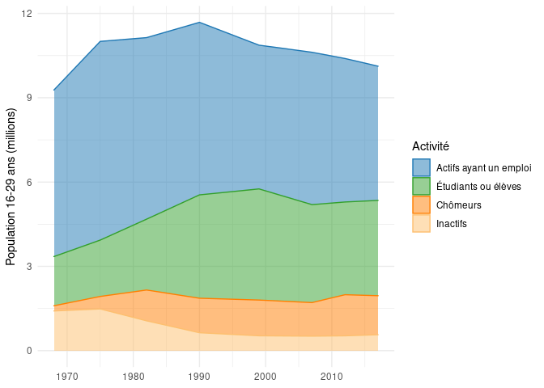

### Questions principales :

-   Est-ce que la formation agit en “amortisseur” entre le chômage et
    l’emploi ?
-   Est-ce que le nombre de jeunes chômeurs ou inactifs est réellement
    constant ?
    -   Hypothèse d’une raison technique dans les données ? (erreur de
        traitement ou biais échantillonnage ?)
    -   Sinon comment l’expliquer ?

## Vue long terme 1971 - 2020

### Les jeunes de 15 à 29 ans en France de 1971 à 2020 selon le statut d’activité

## Représentation de l’activité par année (sans les non-réponses)

### Les jeunes de 15 à 29 ans en France de 1971 à 2020 selon le statut d’activité

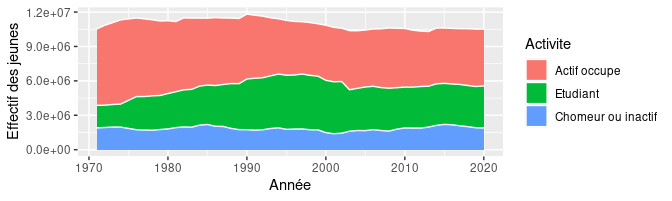

## Représentation de l’activité des jeunes en proportions

### Les jeunes de 15 à 29 ans en France de 1971 à 2020 selon le statut d’activité

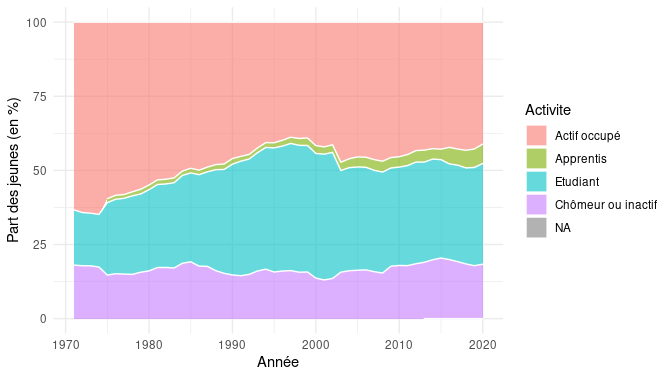

## Observations sur les évolutions concernant le niveau de diplôme des jeunes selon l’année civile (1971 - 2020)

Les trois graphiques suivants informent le lecteur sur la répartition
des jeunes de 15 à 29 ans en France en fonction du niveau de diplôme et
de l’année. Les données qui proviennent d’une année antérieure à 1990
laissent à désirer puisque la variable qui indique le niveau de diplôme
des individus enquêtés est très mal renseignée par ces derniers au sein
des enquêtes qui se sont déroulées avant les années 1990. En effet, le
taux de non-réponse est notamment autour de 30% dans les années 1970
alors qu’il avoisine les 2% dans les années 1990, d’où la hausse
importante et soudaine de l’effectif total en 1990, sans doute en raison
du changement de la méthodologie de l’enquête cette année-là. L’enquête
Emploi n’est donc pas très fiable pour avoir des renseignements sur les
niveaux de diplôme des jeunes avant les années 1990, il vaut ainsi mieux
utiliser d’autres sources.

### Effectif des jeunes de 15 à 29 ans en France selon le niveau de diplôme

### Répartition des jeunes de 15 à 29 ans selon le niveau de diplôme

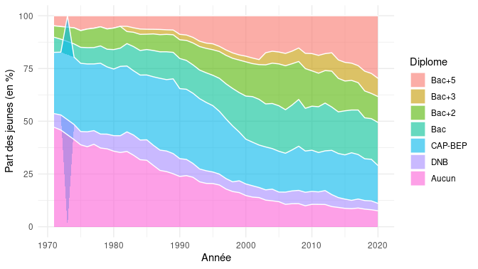

Ce troisième graphique regroupe les données sur le niveau de diplôme à
partir de 1990 afin de représenter les données fiables uniquement. On
remarque que l’effectif de jeunes sans aucun diplôme diminue d’année en
année tandis celui des jeunes ayant un niveau bac ou supérieur au bac
augmente de manière importante. Les jeunes sont donc de plus en plus
diplômés au fil du temps. Cette observation est cohérente avec le
phénomène de la massification scolaire : On assiste à un allongement des
études qui permet à une plus large part de la population d’atteindre le
niveau bac ou supérieur au bac.

### Répartition des jeunes de 15 à 29 ans de 1990 à 2020 selon le niveau de diplôme

## Observations sur les évolutions des effectifs totaux de jeunes (15-29 ans) au fil des années.

Le graphique suivant représente le nombre de jeunes de 15 à 29 ans en
France selon l’année. Les données de la courbe grise sont issues de
notre traitement de données de l’enquête Emploi tandis que celles
représentées par la courbe bleue proviennent d’Eurostat qui a également
effectué un traitement de données à partir de l’enquête Emploi (appelé
Labour Force Survey au niveau européen) à partir de l’édition 2003.
Comparer ces deux courbes va (entre autres) nous permettre de vérifier
la qualité du traitement de données que nous avons effectué. Pour ce
traitement de données, nous avons uniquement pris en compte les données
du premier trimestre. On remarque que les deux courbes ont des niveaux
et des évolutions très similaires de 2003 à 2020 et affichent des
effectifs compris entre 11 millions et 11,5 millions de jeunes de 15 à
29 ans durant cette période. La chute continue à partir des années 1990
est sans doute liée aux générations de baby boomers (nés entre 1945 et
1965) qui vieillissent et quittent progressivement la classe des 15-29
ans.

Ce graphique ajoute une courbe verte qui représente ici les données du
recensement de la population et de l’état civil traitées également par
Eurostat. Les évolutions et tendances semblent identiques mais
l’effectif des jeunes calculé à partir des données du recensement est
néanmoins toujours plus élevé que ceux provenant de l’enquête Emploi.

Sur ce dernier graphique, les effectifs de jeunes de 15 à 29 ans
représentés par la courbe grise sont issus d’un autre traitement de
données que nous avons réalisé et qui cette fois prend en compte les
quatre trimestres de l’année (et non plus seulement le premier comme
c’était le cas pour les deux autres graphiques), ce sont les données
issues de ce traitement que nous utiliserons à partir de maintenant. Les
effectifs sont encore une fois très semblables mais la différence est un
peu plus prononcée sur ce graphique que sur les précédents, Eurostat a
probablement uniquement utilisé les données du premier trimestre de
l’enquête Emploi pour calculer l’effectif des jeunes de 2003 à 2021.

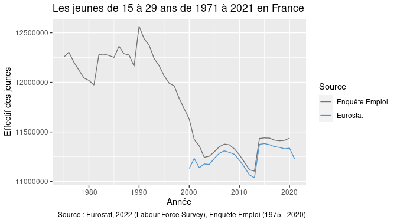

## Observations sur les effectifs de jeunes chômeurs ou inactifs (hors étudiants)

### Nombre de NEET (Not in Education, Employment or Training) de 15 à 29 ans (de 1976 à 2020), source : Enquête Emploi

Les données mobilisées pour ce graphique proviennent de notre traitement
de données effectué à partir de l’enquête Emploi. Durant la période
1976 - 2020, on constate une succession d’augmentations et de
diminutions de l’effectif des jeunes de 15 à 29 ans au chômage ou
inactifs (hors étudiants), aussi appelés NEET (Not in Employment,
Education or Training) à l’échelle internationale. Le nombre de jeunes
chômeurs et inactifs oscille ainsi entre 1,4 millions (en 2001) et 2,2
millions (en 1985 et 2005). Nous assistons donc à une relative stabilité
du nombre de NEET malgré l’effectif total de jeunes de 15 à 29 ans qui a
eu tendance à diminuer dès 1990, comme nous l’avons vu précédemment.

### Nombre de NEET (Not in Education, Employment or Training) de 15 à 29 ans (de 2000 à 2020), source : Eurostat

Pour ce graphique, les données proviennent d’Eurostat, et ne sont
disponibles qu’à partir de l’année 2000. Eurostat a ici utilisé et
traité les données du Labour Force Survey (Enquête Emploi) pour estimer
le nombre de NEET. Le graphique représente le nombre de NEET (Not in
Employment, Education or Training) de 15 à 29 ans en fonction de l’année
civile. Les NEET représentent les jeunes qui ne sont ni en emploi, ni
étudiant ni en formation ils sont donc soit actifs inoccupés (chômeurs)
soit inactifs (hors étudiants). On remarque une importante augmentation
du nombre de NEET en 2008, probablement en raison de la crise économique
des subprimes. Globalement, l’effectif des NEET en France est compris,
selon Eurostat, entre 1,4 et 1,7 millions d’individus de 2000 à 2020,
soit une variation bien moins importante que celle constatée sur le
graphique précédent.

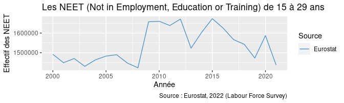

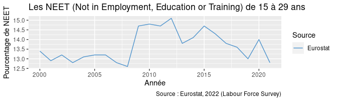

Ce graphique compare les effectifs de NEET d’Eurostat (courbe bleue)
avec les effectifs de NEET obtenus via notre traitement de données
(courbe grise). On remarque que globalement, à partir de 2003, les
effectifs de NEET issus de notre base traitée sont toujours supérieurs à
ceux affichés par Eurostat. Nous avons vu précédemment que les effectifs
de jeunes issus de nos données sont sensiblement les mêmes que ceux
issus d’Eurostat, on ne peut donc pas expliquer ces différences
d’effectifs de NEET par une population de jeunes qui serait surestimée
au sein de notre traitement. Nous avons donc probablement classé une
part plus importante de jeunes dans la catégorie “NEET” par rapport à
Eurostat. Nous allons maintenant tenter de savoir comment exactement
peut s’expliquer cette différence.

    ## Warning: Removed 3 row(s) containing missing values (geom_path).

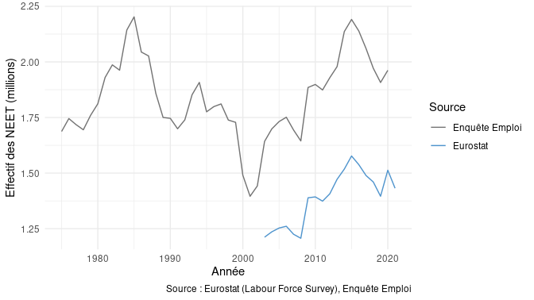

\###Comparaison données de l’Eurostat sur les jeunes avec nos données
(emploi.RData)

Cette section regroupe des graphiques comparant les données d’Eurostat
avec les nôtres afin de décomposer nos données et ainsi essayer de
comprendre d’où provient la différence de résultats concernant les
effectif des NEET. Comme pour les graphiques précédents, la courbe grise
représente les données que nous avons traitées sur l’enquête Emploi
tandis que la bleue représente les données d’Eurostat qui a également
traité les données de l’enquête Emploi (Labour Force Survey).

Ce premier graphique présente le nombre de jeunes de 15 à 29 ans qui
suivent des études ou sont en formation entre 1971 et 2020 selon notre
traitement de données et selon Eurostat. Pour bien comprendre ce
graphique, il est nécessaire de savoir qu’à partir de 2003, pour définir
le statut d’activité d’un individu, l’enquête Emploi ne se base plus sur
la simple déclaration de l’individu comme c’était auparavant le cas. En
effet, à partir de 2003, un statut d’activité est attribué à un individu
en fonction des définitions du BIT (Bureau International du Travail).
Par exemple, un étudiant salarié sera classé comme actif occupé (et non
étudiant) car il aura exercé une activité professionnelle au moins une
heure durant la semaine de référence.

On remarque sur ce graphique que l’impact du changement de définition du
statut d’activité en 2003 se fait ressentir sur nos données : l’effectif
des étudiants chute brutalement en 2003 probablement car les étudiants
salariés ne sont plus catégorisés comme étudiants mais comme actifs
occupés. Eurostat a quant à lui réussi à conserver ces étudiants
salariés, la courbe bleue est alors en continuité avec la courbe grise
d’avant 2003 et révèle le réel effectif des étudiants. Ce graphique
montre que les graphiques précédents portant sur la répartition des
jeunes selon le statut d’activité sont biaisés : les étudiants sont à
partir de 2003 sous-représentés à cause des étudiants salariés classés
comme actifs occupés. Il serait sans doute possible de rectifier cela en
mobilisant une variable qui indiquerait si l’individu suit ou non des
études. Nous pourrions ainsi basculer les actifs occupés qui suivent des
études dans la catégorie des étudiants ou bien créer une nouvelle
catégorie pour les “étudiants salariés” afin de ne pas perdre de vue le
fait qu’ils exercent un emploi.

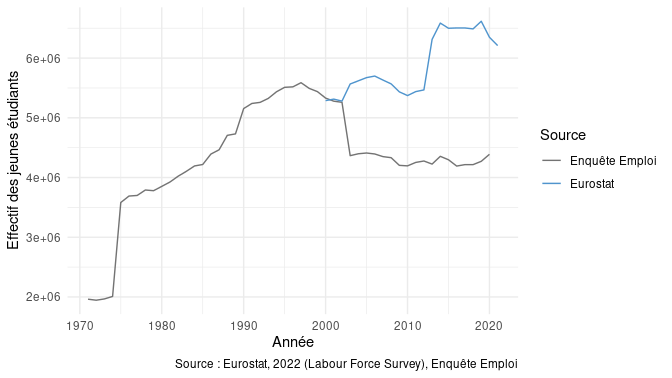

Ce deuxième graphique porte sur les jeunes actifs occupés de 15 à 29
ans. Ici, on arrive à un résultat assez intéressant : Eurostat compte un
effectif de jeunes actifs très proche de celui de nos données traitées,
notre sureffectif de NEET ne provient donc pas d’une sous-estimation du
nombre de jeunes actifs occupés. L’écart observé entre les deux courbes
avant 2003 est sûrement lié aux étudiants salariés encore non
comptabilisés comme actifs occupés au sein de nos données.

Ce dernier graphique représente le nombre de jeunes chômeurs de 2000 à
2020. Un nombre de jeunes chômeurs qui serait bien supérieur à celui
avancé par Eurostat pourrait expliquer notre sureffectif de NEET. Ce
n’est cependant pas le cas ici, on remarque que les effectifs sont très
semblables bien que nos données aient tendance à légèrement surestimer
le nombre de jeunes chômeurs, mais la différence n’est pas assez
importante pour expliquer notre sureffectif de NEET.

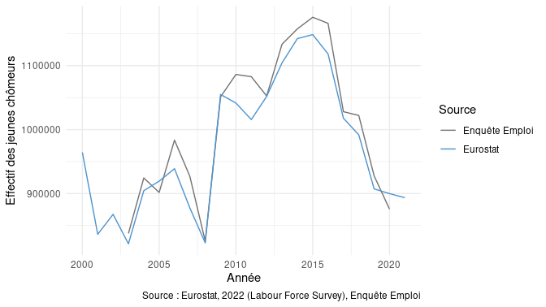

Malgré tous ces graphiques, le sureffectif de NEET est toujours
inexpliqué et peut-être inexplicable : nos données affichent environ le
même nombre d’actifs occupés et de jeunes chômeurs sur la période et la
diminution soudaine du nombre d’étudiants en 2003 est liée à un problème
de définition qui classe les étudiants salariés en actifs occupés (mais
en aucun cas en NEET (chômeur ou inactif hors étudiant)).

## Observations sur les apprentis de 1976 à aujourd’hui

Dans cette partie, nous nous intéressons aux apprentis et alternants
afin d’avoir une compréhension plus fine de la transition de la
formation vers l’emploi chez les jeunes.

Ce premier graphique informe sur la répartition des effectifs de jeunes
de 15 à 29 ans selon le statut d’activité. Il intègre également le
statut d’apprentis/alternants, on peut ainsi remarquer que l’effectif
des apprentis augmente de manière considérable tout au long de la
période 1975-2020 malgré une diminution de l’effectif des jeunes à
partir des années 1990.

### Apprentis de 15 à 29 ans

Ce graphique permet de constater l’évolution de l’effectif des apprentis
de 15 à 29 ans de 1975 à 2020. On observe une augmentation continue de
l’effectif des apprentis : ce dernier passe d’environ 125 000 individus
en 1975 à environ 450 000 en 2020, bien que l’effectif total des jeunes
ait largement diminué durant les années 1990. Cela témoigne d’un
développement important et continu de l’apprentissage en France et d’une
évolution du système éducatif français.

### Apprentis de 15 à 29 ans

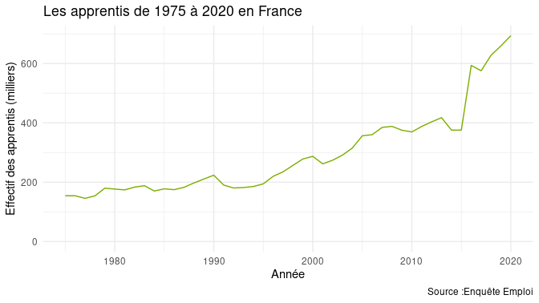

Ce graphique informe sur le statut d’activité des jeunes de 18 à 21 ans
et a pour objectif de mieux comprendre la place de l’apprentissage dans
la transition formation-emploi. On remarque ainsi que les étudiants
constituent la majeure part de cette classe d’âge et que l’effectif des
apprentis prend lui aussi une place plus importante que chez les 15-21
ans et augmente de manière importante tout au long de la période
1975-2020.

### Apprentis de 18 à 21 ans

Ce graphique est presque identique au précédent, seule la position du
statut d’apprentis sur le graphique a été modifiée pour une meilleure
lecture et compréhension de la transition de la formation vers l’emploi.
Aussi, les observations de l’année 2003 ont été supprimées afin de
“lisser” le graphique et d’amoindrir la chute artificielle des effectifs
en 2003, sans doute liée à la modification du format de l’enquête.

Ce graphique présente l’effectif des apprentis de 18 à 21 ans de 1975 à
2020. On observe, comme pour les 15-29 ans, une augmentation constante
de l’effectif des apprentis : il passe d’environ 20 000 individus en
1975 à environ 120 000 en 2020, soit une augmentation de 500% en
l’espace de 45 ans, et ce, malgré une diminution importante de
l’effectif total des jeunes durant la période.

### Apprentis de 18 à 21 ans

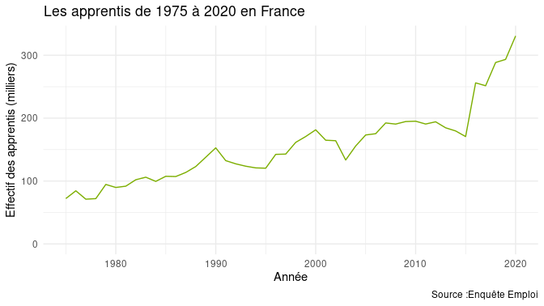

### Statut d’activité des individus entre 30 et 60 ans

Ce dernier graphique représente la répartition des individus de 30 à 60
ans selon leur statut d’activité. On remarque ainsi que les individus de
30 à 60 ans n’ont pas subi de modification notable de leurs effectifs en
2003, contrairement aux 15-29 ans. On peut en conclure qu’à première
vue, seul le statut d’étudiant salarié a réellement posé problème et
provoqué la chute de l’effectif des étudiants en 2003 en raison du
changement de définition du statut d’activité cette année-là.

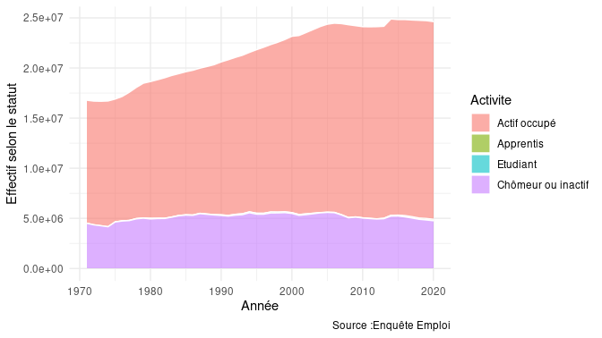
