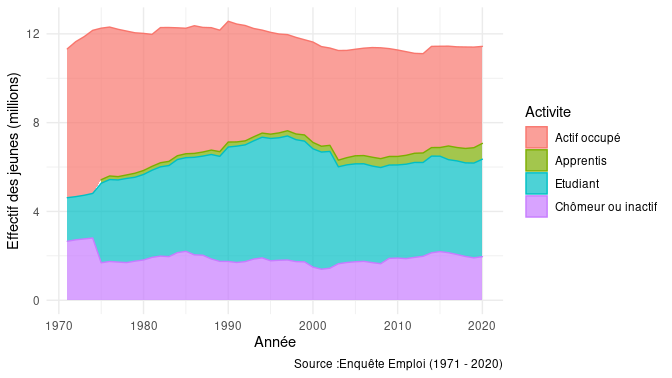
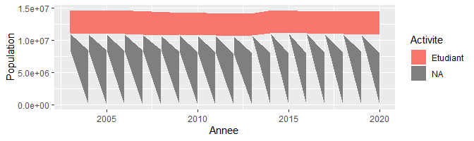

Rapport
================
Julien Gossa
23/05/2022

## Sujet

Notre équipe travaille à la conception d’une méthodologie pour éclairer
l’action publique par l’exploitation des données ouvertes. Ces données
sont de tous ordres et natures, comme en témoignent celles qui se
trouvent sur le portail [data.gouv.fr](data.gouv.fr). Nous sommes plus
particulièrement spécialisés dans les données de l’ESR (Enseignement
supérieur et recherche), et qui concernent donc par exemple les
universités et les étudiants. Ces données sont généralement disponibles
depuis une dizaine d’années.

Ce travail nécessite une mise en contexte sur un plus long terme,
permettant de mieux saisir quelles sont les évolutions historiques de
notre appareil de formation. C’est dans ce cadre que nous avons effectué
une exploitation exploratoire de la base SAPHIRE de l’INSEE, regroupant
notamment des données issues de l’enquête emploi. L’objectif est de
visualiser la massification (l’augmentation du nombre d’étudiants) et
son rapport avec l’insertion professionnelle, donc l’emploi des jeunes.

Cette exploitation révèle une remarquable constance des jeunes chômeurs
et inactifs (Figure 1). Cela permet de soulever l’hypothèse d’un rôle
d’« amortisseur » de la formation entre la jeunesse et l’emploi :
lorsque des emplois sont disponibles, les jeunes sortiraient plus tôt du
système éducation ; lorsque les emplois sont rares, les jeunes
prolongeraient leurs études.P

## Vue long terme

### Agemax different

