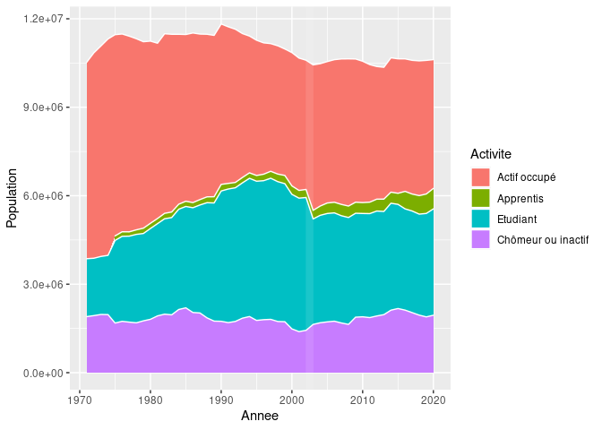

Draft
================

<!-- -->

<!-- -->

<!-- -->

<!-- -->

    ## Warning: No renderer available. Please install the gifski, av, or magick package
    ## to create animated output

    ## Warning: No renderer available. Please install the gifski, av, or magick package
    ## to create animated output

<!-- -->

## Diplome vs Salaire

Salaire moyen = moyenne des salaires moyens pondérée par population ?

<!-- -->

    ## Warning: No renderer available. Please install the gifski, av, or magick package
    ## to create animated output

    ## Warning: No renderer available. Please install the gifski, av, or magick package
    ## to create animated output
