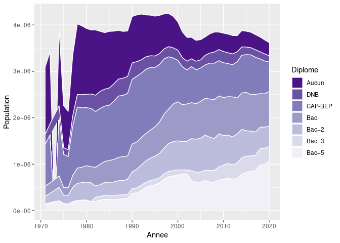
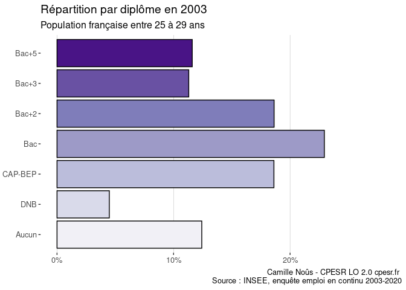
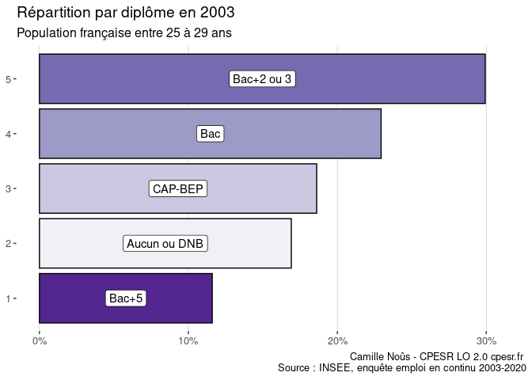

Draft
================

    ## Warning: Removed 10 rows containing missing values (position_stack).

<!-- -->

<!-- -->

<!-- -->

<!-- -->

<!-- -->

<!-- -->

## Diplome vs Salaire

Salaire moyen = moyenne des salaires moyens pondérée par population ?

<!-- -->

<!-- -->

<!-- -->
