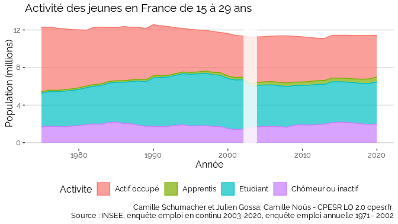
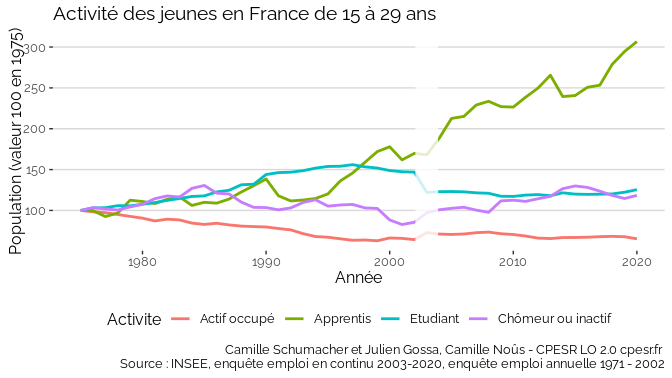
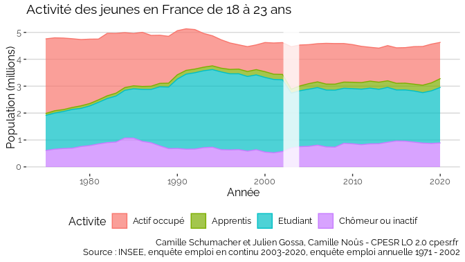
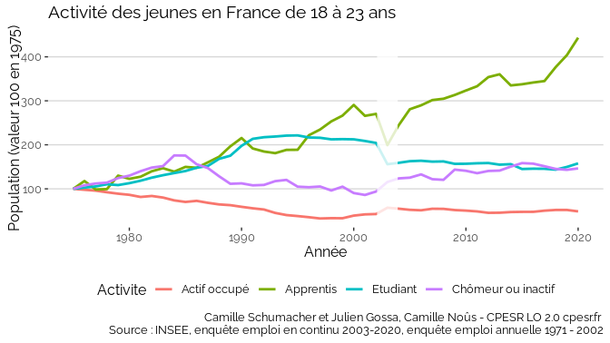

Questions concernant la relative stabilité du nombre de jeune inactifs
ou chômeurs
================

En utilisant l’enquête Emploi en continu (2003-2020) ainsi que l’enquête
Emploi annuelle (1971 - 2002) de l’INSEE, nous avons pu mettre en
évidence une relative invariance du nombre absolu de jeunes inactifs
(hors étudiants) ou chômeurs sur 50 ans. Ainsi, on observe un minimum de
1.4 pour un maximum de 2.2 millions, alors que les autres séries varient
de plusieurs millions.

En se concentrant sur les 18-23 ans, la différence est plus marquée,
mais reste très inférieure aux variations des autres séries, et semble
toujours contenue sous une barre invisible.

Les représentations en valeur 100 montrent des inversions de tendance
plus fréquentes pour les jeunes chômeurs et inactifs que pour les autres
séries.

Nous avons travaillé à confirmer ces représentations et traitements, en
vérifiant l’encodage des variables et en confrontant les données à
celles d’Eurostat qui a également traité les données de l’enquête Emploi
(Labour Force Survey), et du recensement de la population.

**Nous cherchons maintenant à trouver des explications ou des hypothèses
qui pourraient expliquer ce qu’on observe sur ces représentations.**
Toute aide sera appréciée.

NB : il existe une rupture de série en 2003 due à une réforme
méthodologique de l’enquête.
